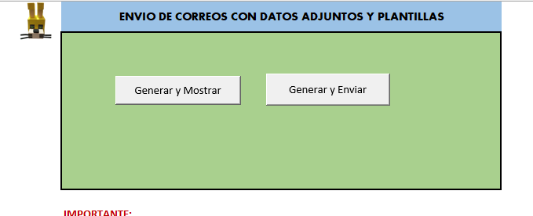
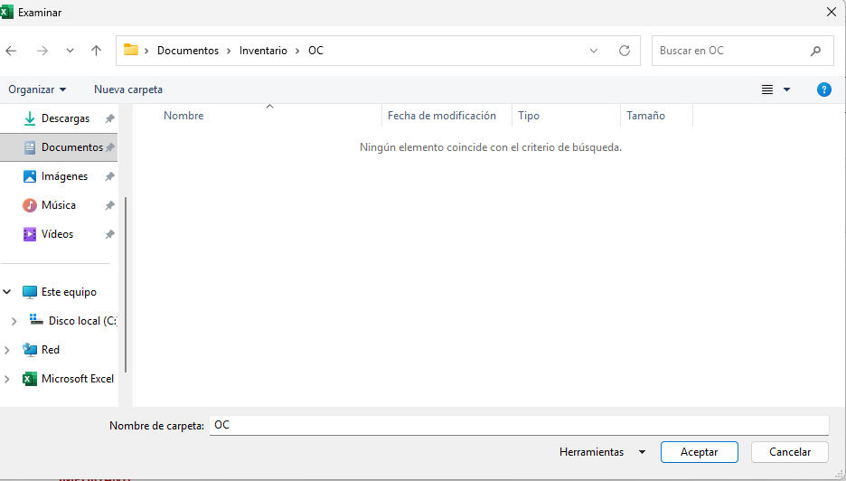
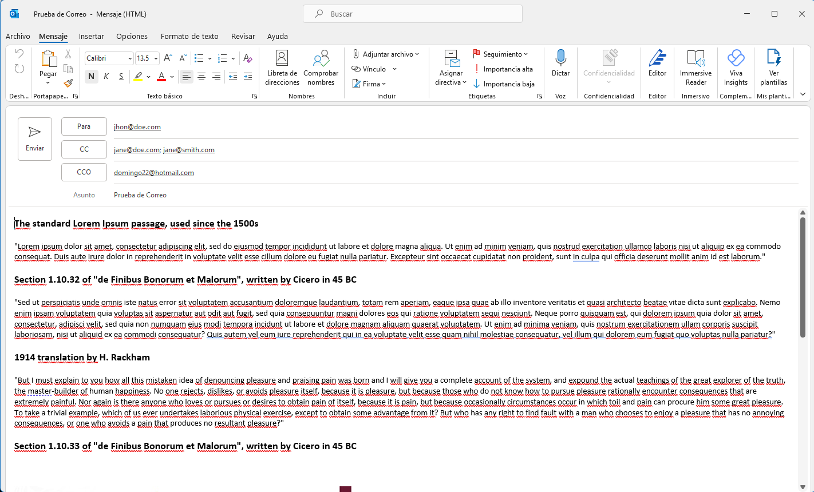
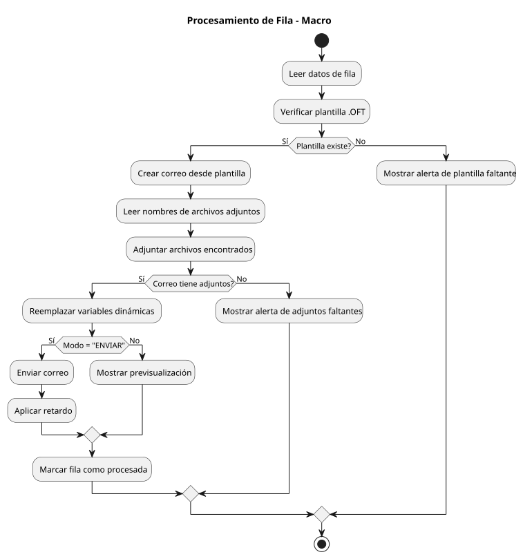

# 📧 Hermes - Automatización de Correos con Excel + Outlook

[](https://www.gnu.org/licenses/agpl-3.0)
[](CHANGELOG.md)
[](CONTRIBUTING.md)
[]()
[]()

**Automatización de Excel y Outlook para el envío de correos electrónicos personalizados con plantillas, variables dinámicas y archivos adjuntos..**

<p align="center">
  <strong>🇪🇸 Español</strong> | <a href="README_EN.md">🇬🇧 English</a>
</p>

---

## 📋 Tabla de Contenidos

- [Descripción General](#descripción-general)
- [Características Principales](#características-principales)
- [Capturas de Pantalla](#capturas-de-pantalla)
- [Requisitos](#requisitos)
- [Estructura de la Hoja BASE](#estructura-de-la-hoja-base-excel)
- [Variables Dinámicas](#uso-de-variables-dinámicas)
- [Plantillas .OFT](#plantillas-oft)
- [Modos de Ejecución](#modos-de-ejecución)
- [Instalación y Configuración](#️-instalación-y-configuración)
- [Arquitectura del Código](#arquitectura-del-código)
- [Flujo de Procesamiento](#flujo-de-procesamiento)
- [Ejemplo Práctico Completo](#ejemplo-práctico-completo)
- [Preguntas Frecuentes (FAQ)](#-preguntas-frecuentes-faq)
- [Troubleshooting](#troubleshooting)
- [Contribuir](#contribuir)
- [Licencia](#licencia)
- [Autor](#️-autor)

---

## Descripción General

Hermes automatiza el envío de correos electrónicos personalizados usando **Excel + Outlook**, con soporte completo para:

- Plantillas Outlook **.OFT**
- Adjuntos automáticos basados en reglas por nombre
- Variables dinámicas ilimitadas desde la hoja Excel
- Control de envíos masivos con retardo configurable
- Registro automático de procesamiento

Diseñado para cargas de trabajo en empresas, contabilidad, cobranza, administración, soporte y facturación.

---

## Características Principales

| Característica | Descripción |
|----------------|-------------|
| ✅ Múltiples plantillas .OFT | Usa diferentes plantillas por fila |
| ✅ Variables dinámicas ilimitadas | Cualquier columna se convierte en variable |
| ✅ Adjuntos inteligentes | Detecta archivos por nombre base |
| ✅ Envío seguro | Retardo configurable entre correos |
| ✅ Modo previsualización | Revisa borradores antes de enviar |
| ✅ Registro automático | Columnas de estado y fecha auto-creadas |
| ✅ Alto rendimiento | Maneja miles de filas sin degradación |

---

## Capturas de Pantalla

| Menú Principal | Selección de Archivos | Resultados |
|----------------|----------------------|------------|
|  |  |  |

---

## Requisitos

| Requisito | Detalles |
|-----------|----------|
| SO | Windows 10 / 11 |
| Software | Microsoft Excel + Microsoft Outlook |
| Config | Macros habilitadas, permisos de automatización COM |

---

## Estructura de la Hoja BASE (Excel)

| Columna | Contenido | Ejemplo |
|---------|-----------|---------|
| A | ADJUNTOS (separados por `\|`) | `factura01\|certificado` |
| B | TO | `cliente@mail.com` |
| C | CC | `gerente@empresa.com` |
| D | BCC | `auditor@empresa.com` |
| E | Asunto | Factura del mes |
| F | Plantilla | `factura_cliente.oft` |
| G→∞ | Variables dinámicas | NOMBRE, RFC, TOTAL, FECHA, etc. |

**Columnas auto-generadas:**
- Estado de procesamiento (`Sent`, `Display`, `Error`)
- Fecha/Hora de procesamiento

---

## Uso de Variables Dinámicas

**Paso 1:** Define los encabezados de columna como nombres de variable:
```
NOMBRE | FECHA | RFC | TOTAL | OBSERVACION
```

**Paso 2:** Úsalos en tu plantilla .OFT (HTML):
```html
Hola [NOMBRE], tu factura del [FECHA] fue emitida por [TOTAL].
```

**Resultado:** El motor reemplaza **todas las variables** automáticamente.

---

## Plantillas .OFT

Guarda tus plantillas desde Outlook:

**Archivo → Guardar como → Plantilla Outlook (.oft)**

Las plantillas soportan HTML completo: imágenes, estilos, tablas, firmas, etc.

Ejemplos de variables:
```
[NOMBRE]
[TOTAL]
[FECHA_LIMITE]
[PRODUCTO]
```

---

## Modos de Ejecución

### 1. Previsualizar correos
El sistema procesa cada fila y muestra el borrador del correo. El usuario los envía manualmente.
- Útil para verificar que las variables están correctamente reemplazadas
- Paginación interactiva entre páginas

### 2. Enviar automáticamente
El sistema te pedirá el retardo (en segundos) entre envíos.
- Envía todos los correos automáticamente
- Control de tasa incorporado

---

## Instalación y Configuración

1. Abrir Excel
2. Presionar `ALT + F11` (Editor de Visual Basic)
3. Menú: *Archivo → Importar archivo…*
4. Importar todos los `.bas` desde `/src`
5. Abrir el archivo Excel que contiene la hoja **BASE**
6. Ejecutar macros:
   - `ProcessDisplay` (modo previsualización)
   - `ProcessSend` (modo envío automático)

---

## Arquitectura del Código

| Módulo | Rol |
|--------|-----|
| **hermes.bas** | Lógica principal, control de flujo |
| **ProcessRow.bas** | Procesamiento por fila (adjuntos, plantilla, envío) |
| **Utils.bas** | Construcción y aplicación de variables |
| **Variables.bas** | Funciones genéricas reutilizables |

**Beneficios:**
- Mantenimiento fácil
- Extensión sin romper funciones
- Colaboración en proyectos GitHub
- Integración continua en futuro

---

## Flujo de Procesamiento




---

## Ejemplo Práctico Completo

### 1. Datos en Excel:

| A | B | C | D | E | F | G | H |
|---|---|---|---|---|---|---|---|
| factura01 | cliente@x.com | cc@x.com | | Factura | factura.oft | NOMBRE | TOTAL |
| factura02 | cliente2@x.com | | | Factura | factura.oft | Luis | 1200 |

### 2. Plantilla:
```html
Hola [NOMBRE],

Tu factura adjunta tiene un total de [TOTAL].

Saludos.
```

### 3. Archivos en carpeta:
```
factura01.pdf
factura02.pdf
```

### 4. Resultado:
- Correo enviado o previsualizado
- Plantilla con variables reemplazadas
- Adjuntos correctos
- Marca de procesado en columnas nuevas

---

## Preguntas Frecuentes (FAQ)

**¿Puedo usar imágenes en las plantillas?**
Sí. Outlook maneja HTML completo.

**¿Debe Outlook estar abierto?**
No, se abrirá automáticamente si es necesario.

**¿Funciona en Mac?**
No. Outlook COM automation solo funciona en Windows.

**¿Puedo enviar miles de correos?**
Sí, pero usa retardo entre correos para evitar bloqueos.

---

## Troubleshooting

### Outlook bloquea el envío
Revisa: `Archivo → Centro de confianza → Configuración del programa`

### No encuentra la plantilla
Verifica extensión `.oft` y ruta.

### No adjunta archivos
Revisa que el **nombre base** coincida (sin extensión).

---

## Contribuir

Las contribuciones son bienvenidas. Consulta [CONTRIBUTING.md](CONTRIBUTING.md) para más detalles.

---

## Licencia

Este proyecto está bajo **GNU AGPLv3**.
Consulta el archivo [LICENSE](LICENSE).

---

## Autor

**Alex Herrera**
📧 crowslayer@gmail.com

---

## Donaciones

Si deseas apoyar este proyecto:

<a href="https://www.paypal.com/donate/?hosted_button_id=3VLCPQZWUGACS">
  
</a>

¡Gracias por contribuir!
