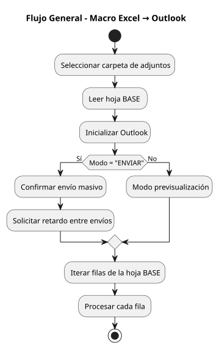

# Automatización de Envío de Correos con Excel + Outlook  
### Envío masivo profesional con plantillas .OFT, variables dinámicas y adjuntos automáticos  
**Autor:** Alex Herrera  
**Licencia:** AGPLv3  

---

# Tabla de Contenidos

- [Tabla de Contenidos](#-tabla-de-contenidos)
- [Descripción General](#-descripción-general)
- [Características Principales](#-características-principales)
- [Requisitos](#-requisitos)
- [Estructura de la Hoja BASE (Excel)](#-estructura-de-la-hoja-base-excel)
- [Uso de Variables Dinámicas](#-uso-de-variables-dinámicas)
- [Plantillas .OFT](#-plantillas-oft)
- [Modos de Ejecución](#-modos-de-ejecución)
- [Instalación y Configuración](#️-instalación-y-configuración)
- [Arquitectura del Código](#-arquitectura-del-código)
- [Flujo de Procesamiento](#-flujo-de-procesamiento)
- [Ejemplo Práctico Completo](#-ejemplo-práctico-completo)
- [Preguntas Frecuentes (FAQ)](#-preguntas-frecuentes-faq)
- [Troubleshooting](#-troubleshooting)
- [Licencia](#-licencia)
- [Autor](#️-autor)
- [Donaciones](#️-donaciones)

---

#  Descripción General

Este proyecto automatiza el envío de correos electrónicos personalizados usando **Excel + Outlook**, con soporte completo para:

- Plantillas Outlook **.OFT**
- Adjuntos automáticos basados en reglas por nombre
- Variables dinámicas ilimitadas desde la hoja Excel
- Control de envíos masivos con retardo configurable
- Registro automático de procesamiento

Diseñado para cargas de trabajo en empresas, contabilidad, cobranza, administración, soporte y facturación.

---

# Características Principales

 **Múltiples plantillas .OFT**  
 **Variables dinámicas ilimitadas**  
 **Adjuntos por coincidencia de nombre base**  
 **Envío seguro con retardo entre correos**  
 **Modo previsualización y modo envío automático**  
 **Registro automático de procesamiento en columnas dinámicas**  
 **Compatible con miles de filas sin degradación de rendimiento**  
 

---

# Requisitos

- Windows 10 / 11  
- Microsoft Excel  
- Microsoft Outlook  
- Macros habilitadas  
- Permiso para automatización COM (según políticas de la empresa)

---

# Estructura de la Hoja BASE (Excel)

Ejemplo de estructura recomendada:

| Columna | Contenido | Ejemplo |
|--------|-----------|---------|
| A | ADJUNTOS (separados por \|) | factura01\|certificado |
| B | TO | cliente@mail.com |
| C | CC | gerente@empresa.com |
| D | BCC | auditor@empresa.com |
| E | Asunto | Factura del mes |
| F | Plantilla | factura_cliente.oft |
| G→∞ | Variables dinámicas | NOMBRE, RFC, TOTAL, FECHA, etc. |

 **Las últimas dos columnas se agregan automáticamente:**

- Estado de procesamiento  
- Fecha/Hora  

---

# Uso de Variables Dinámicas

En el encabezado colocas nombres:
NOMBRE | FECHA | RFC | TOTAL | OBSERVACION

En la plantilla (HTML del .OFT):

Hola [NOMBRE], tu factura del [FECHA] fue emitida por [TOTAL].

El motor reemplaza **todas las variables** automáticamente.

✔ No requiere modificar el código  
✔ Puedes usar tantas como quieras  

---

# Plantillas .OFT

Guarda tus plantillas desde Outlook:

**Archivo → Guardar como → Plantilla Outlook (.oft)**

Dentro puedes usar HTML, imágenes, estilos, tablas, firmas, etc.

Ejemplos:

[NOMBRE]
[TOTAL]
[FECHA_LIMITE]
[PRODUCTO]

---

# Modos de Ejecución

### 1. Previsualizar correos

El sistema procesara cada fila y mostrara el borrador del correo. El usuario debera enviarlos manualmente.
Esto es util para verificar que las variables están correctamente reemplazadas.

### 2. Enviar automáticamente

El sistema te pedirá el retardo (en segundos) entre envíos.

---

# Instalación y Configuración

1. Abrir Excel  
2. ALT + F11 (Visual Basic Editor)  
3. Menú *Archivo → Importar archivo…*  
4. Importar todos los `.bas` desde `/src`  
5. Abrir el archivo Excel que contiene la hoja **BASE**  
6. Ejecutar macros:

- `ProcessDisplay`  
- `ProcessSend`  

---

# Arquitectura del Código

| Módulo | Rol |
|--------|-----|
| **Hermes.bas** | Lógica principal, control de flujo |
| **ProcessRow.bas** | Procesa cada fila (adjuntos, plantilla, envío) |
| **Utils.bas** | Construcción y aplicación de variables |
| **Variables.bas** | Funciones genéricas reutilizables |

Esta arquitectura permite:

✔ Mantenimiento fácil  
✔ Extensión sin romper funciones  
✔ Colaboración en proyectos GitHub  
✔ Integración continua en futuro  

---

# Flujo de Procesamiento

---

# Ejemplo Práctico Completo

### 1. Datos en Excel:

| A | B | C | D | E | F | G | H |
|---|---|---|---|---|---|---|---|
| factura01 | cliente@x.com | cc@x.com | | Factura | factura.oft | NOMBRE | TOTAL |
| factura02 | cliente2@x.com | | | Factura | factura.oft | Luis | 1200 |

### 2. Plantilla:

Hola [NOMBRE],

Tu factura adjunta tiene un total de [TOTAL].

Saludos.

### 3. Archivos en carpeta:
factura01.pdf
factura02.pdf

### 4. Resultado:

- Correo enviado o previsualizado  
- Plantilla con variables reemplazadas  
- Adjuntos correctos  
- Marca de procesado en columnas nuevas  

---

# Preguntas Frecuentes (FAQ)

### ¿Puedo usar imágenes en las plantillas?  
Sí. Outlook maneja HTML completo.

### ¿Debe Outlook estar abierto?  
No, se abrirá automáticamente si es necesario.

### ¿Funciona en Mac?  
No. Outlook COM automation solo funciona en Windows.

### ¿Puedo enviar miles de correos?  
Sí, pero usa retardo entre correos para evitar bloqueos.

---

# Troubleshooting

### Outlook bloquea el envío  
Revisa:  
`Archivo → Centro de confianza → Configuración del programa`

### No encuentra la plantilla  
Verifica extensión `.oft` y ruta.

### No adjunta archivos  
Revisa que el **nombre base** coincida (sin extensión).

---

# Licencia

Este proyecto está bajo **GNU AGPLv3**.  
Consulta el archivo `LICENSE`.

---

# Autor

**Alex Herrera**  
 crowslayer@gmail.com  

---

# Donaciones

Si deseas apoyar este proyecto:

****

¡Gracias por contribuir!
